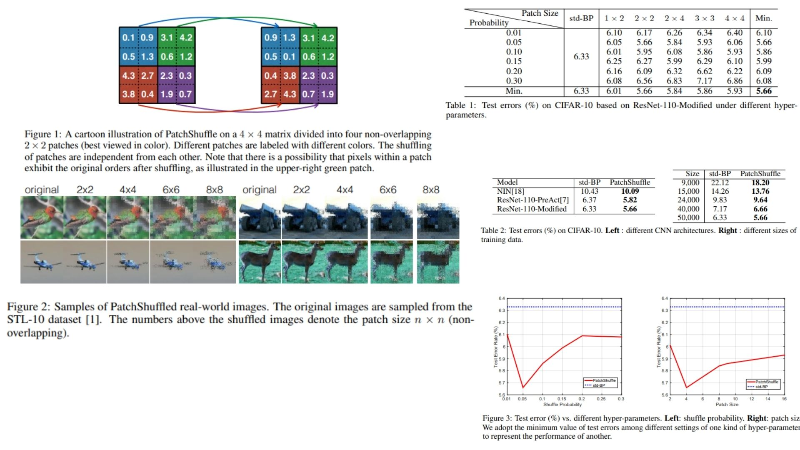

# 🌼 PatchShuffle Replication – Regularizing CNNs via Patch Shuffling

This repository provides a **PyTorch-based replication** of  
**PatchShuffle – Regularization for CNNs by Shuffling Local Patches**.

The focus is **understanding PatchShuffle regularization**,  
rather than fully training models or maximizing benchmark accuracy.

- VGG-style backbone with **PatchShuffle layers** 🌿  
- Randomly shuffling pixels within patches for **local variation** 🍃  
- Weighted combination in **loss function** using shuffle probability $$\epsilon$$ ⚖️  
- Demonstrates theoretical **robustness and regularization** 🌱  

**Paper reference:** [PatchShuffle: Regularizing CNNs](https://arxiv.org/abs/1707.07103) 🔎

---

## 🌸 Overview – PatchShuffle Architecture



### 🌷 High-level Pipeline

1. **Input image**

```math
X \in \mathbb{R}^{C \times H \times W}
```

2. **VGG-style backbone + PatchShuffle layers**

```math
F^{(l)} = PatchShuffle(f(W^{(l)} * F^{(l-1)})), \quad l=1..L
```
3. **Flatten + Fully-connected classifier**

```math
\hat{Y} = FC(F^{(L)})
```
4. **PatchShuffle Loss**

```math
\mathcal{L}_{\text{total}} = \mathcal{L}(X, Y, \theta) + \frac{\epsilon}{1-\epsilon}\mathcal{L}(T(X), Y, \theta)
```
> $$T(X)$$ is the PatchShuffle-transformed input; $$\epsilon$$ is the shuffle probability.

---

## 🌿 What the Model Demonstrates

- **PatchShuffle layers**: randomly shuffle pixels within patches → local variations 🌾  
- **Backbone**: hierarchical feature extraction 🌱  
- **Regularization**: reduces overfitting and increases robustness 🌳  
- **Loss function**: combines original + shuffled input weighted by $$\epsilon$$ ⚖️  
- **Forward-only**: theoretical replication; no training/test conducted 🧪  

---

## 📦 Repository Structure

```bash
PatchShuffle-Replication/
├── src/
│   ├── layers/
│   │   ├── conv_block.py          
│   │   ├── activation.py         
│   │   ├── normalization.py      
│   │   └── pooling.py             
│   │
│   ├── backbone/
│   │   ├── vgg_blocks.py        
│   │   └── feature_maps.py        
│   │
│   ├── model/
│   │   └── patchshuffle_cnn.py         
│   │
│   ├── patchshuffle/
│   │   └── patchshuffle_layer.py
│   │
│   ├── loss/
│   │   └── patchshuffle_loss.py        
│   │
│   └── config.py                  
│
├── images/
│   └── figmix.jpg
│
├── requirements.txt
└── README.md
```

---

## 🔗 Feedback

For questions or feedback, contact: [barkin.adiguzel@gmail.com](mailto:barkin.adiguzel@gmail.com)
